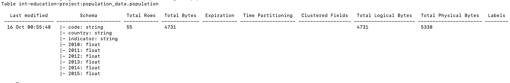
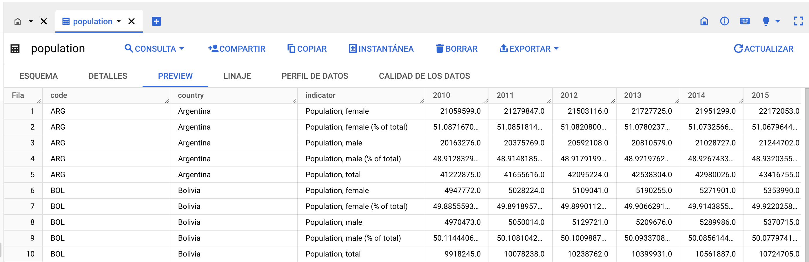

# Code Challange 2023

Project that performs ETL process with extraction, cleaning, transformation, and loading data to GCP BigQuery.

* __Time of analysis v1:__ October 15, 2023.
* __Tools v1:__ .CSV, Python, SQL, BigQuery GCP, Trello.

## Background
This project extracts data of the
[Health Nutrition and Population Statistics](https://www.kaggle.com/datasets/theworldbank/health-nutrition-and-population-statistics/) from the World Bank stored in [Kaggle.com](https://www.kaggle.com/).

## Getting started

Clone the repository in the folder:

```console
git clone git@github.com:denisseee/code_challange.git code_challenge
cd code_challenge
```

Install the dependencies:

```console
  pip install pandas
  pip install fugue
  pip install "fugue[sql]"
```

Finally, run the code to start the ETL process. 
This will generate 2 files: ```cleaned_data.csv``` and ```cleaned_data_after_sql.csv```.

```console
  python3 main.py
```

## Workflow description

### 1. Cleaning
The data is imported from the .CSV and inspected.

```py
### Import csv file
data = pd.read_csv('./csv/data.csv')
df = pd.DataFrame(data)

### Inspecting data
df.head(15)
df.shape # (89010, 61)
df.dtypes
# df.info()
df.describe()
```

### 2. Transfomation
The manipulation data drops any duplicates, transform NaN values, and delete empty rows without indicators or any information.

```py
# Delete duplicates
df.drop_duplicates

# Missing values
df.fillna(0, inplace=True)

# Delete rows without indicators
df_filtered_index = df[df['1960'] == 0].index
df.drop(df_filtered_index, inplace=True)
df.reset_index(drop=True, inplace=True)
df.head(15)
df.shape # (35468, 61)

# Delete empty column n° 60
df.pop(df.columns[-1])
```

The data is exported to .CSV file:
```py
### Export to csv file
df.to_csv('cleaned_data.csv', index=False)
```

### 3. SQL
The data is manipulated in SQL, selected by Code, Country, Indicator, and the last 6 years.

```sql
  SELECT 
    `Country Code` AS `code`,
    `Country Name` AS `country`,
    `Indicator Name` AS `indicator`,
    `2010`,
    `2011`,
    `2012`,
    `2013`,
    `2014`,
    `2015`
  FROM 
    df 
  WHERE 
    `Country Name` IN ('Argentina','Bolivia','Brazil','Chile','Colombia','Ecuador','French Guiana','Guyana','Paraguay','Peru','Suriname','Uruguay','Venezuela')
  AND 
    `Indicator Name` IN ('Population, male','Population, male (% of total)','Population, female','Population, female (% of total)','Population, total')
  PRINT
```

The results from the query are exported to a new .CSV file:
```py
# Export sql data to data csv
sql_table = fugue_sql(query)
df2 = pd.DataFrame(sql_table)
df2.to_csv('cleaned_data_after_sql.csv', index=False)
```

## BigQuery: Load data with GCP SDK
The data is loaded to BigQuery with GCP SDK.

From GCP SDK, set or create a project:
```console
➜  google-cloud-sdk gcloud config set project `PROJECT ID`
```

Upload file ```cleaned_data_after_sql.csv``` to BigQuery with the next CLI command:
```console
➜  google-cloud-sdk bq load --source_format=CSV --skip_leading_rows=1 population_data.population /Users/denisse/code_challenge_2023/cleaned_data_after_sql.csv code:string,country:string,indicator:string,2010:float,2011:float,2012:float,2013:float,2014:float,2015:float     
```

See the results from the terminal:
```console
➜  google-cloud-sdk bq show population_data.population
```

<p align="left"></p>

Check the schema and the preview from BigQuery:
<p align="left"></p>

## Trello

Sprint description and details of the tasks' project are in Trello: [Code Challenge](https://trello.com/b/xL9BLXt2/code-challenge).

## Javascript snippet


